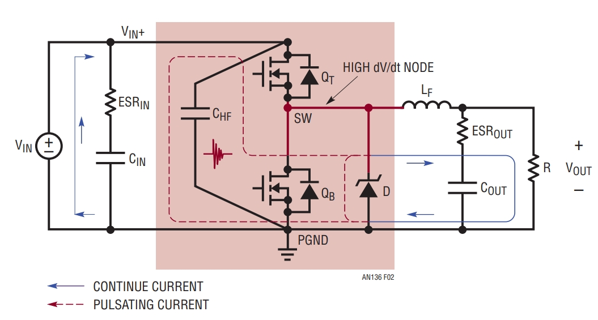

我把这份 `pcb-power-layout.html` 从 **电力电子技术内容、HTML/CSS/JS、交互与可访问性** 三个角度都过了一遍。总体评价是：**文档框架很好，真正需要优先修改的是若干技术性表述，而不是页面结构。** 目录统计也与正文基本一致：12 章、33 个三级小节、18 张图；静态检查没有发现重复 `id` 或失效的页内锚点。

### 一、我认为必须改的技术问题

| 优先级 | 位置      | 问题                          | 建议                                                         |
| ------ | --------- | ----------------------------- | ------------------------------------------------------------ |
| 🔴 高   | 2.2 Boost | **Hot loop 判断反了**         | Boost 的高频换流环在**输出侧**，由 MOSFET、整流二极管和高频输出电容组成 |
| 🔴 高   | 7.1 DPT   | **双脉冲时序写错**            | 第一脉冲结束看关断；第二脉冲开始看开通/反向恢复              |
| 🔴 高   | 1.3       | `I·ESL·0` 公式不成立          | 应写 `vL=L·di/dt≈0`，且只能说连续路径 di/dt 较小             |
| 🔴 高   | 1.2       | dv/dt 与共源电感关系混杂      | 共源电感主要由 **di/dt** 激励；dv/dt 主要通过 Cgd、寄生电容注入 |
| 🟠 中高 | 2.3       | “层间电容替代长走线”机理错误  | 本质是去程/回程紧耦合、磁场抵消、减小 loop inductance        |
| 🟠 中高 | 3.2       | “PGND/SGND 必须单点”太绝对    | 应改成“依据控制器 datasheet/reference layout”                |
| 🟠 中   | 5.1       | “Rg 放驱动器旁边等于没放”过头 | 仍可限流/调速度，只是对局部 gate ringing 阻尼不如贴 Gate     |
| 🟠 中   | 5.2       | SiC/GaN 都用 −2～−5 V         | 强烈依赖具体器件，不宜作为统一规则                           |
| 🟠 中   | 7.2       | `L=ΔV/(di/dt)` 写得过于“精确” | 应注明是**一阶估算**                                         |
| 🟡 中   | 4.3       | “+0.3%、−20°C”泛化            | 必须注明具体器件、工况和测试条件，最好换成原厂一手资料       |

下面几个值得重点解释。

------

## 1. Boost 的 Hot Loop 是目前最明显的技术错误

你现在写的是：

> “Boost……输入侧即热回路所在地。”

而图 5 图注进一步写成：

> “输出二极管与输出电容构成的是连续路径，只需宽铜。”

这个是反的。

ADI AN-136 原文明确说明：Boost 中高频陶瓷电容 `CHF` 应布置在**输出侧**，靠近 MOSFET `QB` 和 Boost diode `D`；需要最小化的是：

**QB → D → 输出侧 CHF → QB**

形成的脉冲电流环。([模拟器件](https://www.analog.com/cn/resources/app-notes/an-136.html?utm_source=chatgpt.com))

因此 2.2 建议改成类似：

> Boost 中输入电感电流相对连续，而二极管/开关管之间发生高频换流。高 di/dt hot loop 主要由 Q_B、整流二极管 D 与输出侧高频陶瓷电容 C_HF 构成。因此 C_HF 应尽可能靠近 Q_B 与 D，使该换流环路面积最小。

这不是小措辞问题，而是**会直接教错 PCB 布局方向**，优先级最高。

------

## 2. 双脉冲测试的时序前后矛盾

你图 7.1 的说明写：

> `t1` 下管开通 → `t2` 体二极管续流 → `t3` “下管再次关断”……

标准 DPT 更准确的逻辑是：

**第一脉冲开通**
→ 电感电流升到目标值

**第一脉冲关断**
→ 测 `Eoff`、关断 dv/dt、di/dt、VDS overshoot
→ 电感电流经续流二极管流动

**第二脉冲开通**
→ 测 `Eon`、开通 di/dt
→ 同时观察续流二极管反向恢复

Tektronix 的 DPT 方法也是这样定义的：stage 2 是**第一脉冲的 turn-off**，stage 3 是**第二脉冲的 turn-on**。([Tek](https://www.tek.com/en/documents/application-note/double-pulse-test-tektronix-afg31000-arbitrary-function-generator))

有意思的是，你后面的自测答案其实写得更加接近正确：

> “第二次开通沿看开通特性……长脉冲末端关断沿看换流回路电感。”

所以这里属于**正文与后文不一致**。

------

## 3. `I·ESL·0` 这个表达要直接删除

这里：

> “连续路径电流基本恒定，寄生电感无所谓（它两端电压只是 I·ESL·0）”

`I × ESL × 0` 在量纲上就不成立。

电感始终是：

$v_L=L\frac{di}{dt}$

你真正想表达的是：

$\frac{di}{dt}\approx0 \quad\Rightarrow\quad v_L\approx0$

但我甚至不建议写“寄生电感无所谓”。

更严谨的是：

> **在稳态且纹波较小的连续电流路径中，开关沿产生的 di/dt 通常显著低于换流路径，因此布局重点更多是导通损耗、压降和热设计；但其寄生电感仍会影响纹波、瞬态响应和 EMI，不能完全忽略。**

这样就很准确。

------

## 4. di/dt 与 dv/dt 的分类还可以更干净

你现在表格中把：

> dv/dt → 共源电感、米勒电容、开关节点对地电容

放到一起。

这里建议重新整理成两条非常清楚的物理链：

**di/dt 路径：**

$v=L\frac{di}{dt}$

作用于：

功率换流回路电感、封装电感、**共源电感 `Ls`**

产生：

VDS overshoot、ground bounce、VGS 扰动、振铃。

**dv/dt 路径：**

$i=C\frac{dv}{dt}$

作用于：

`Cgd` / Miller capacitance、SW 对散热器/机壳/地寄生电容、隔离寄生电容等

产生：

Miller 误导通、共模电流、共模 EMI。

这样读者脑中会形成非常漂亮的一组对偶：

> **di/dt 找 L；dv/dt 找 C。**

你现在已经有这个思想，但表格还没有完全贯彻。

------

## 5. “层间电容替代长走线”建议重写

目前写：

> “让热回路的去程与回程在相邻两层正对……用层间电容‘平行板’替代长走线。”

后半句物理解释不正确。

不是让开关电流“通过 PCB 层间电容穿过去”，真正重要的是：

**去程和回程非常靠近 → 磁场相互抵消 → loop area 减小 → partial inductance/mutual inductance 组合后的总回路电感降低。**

可以改成：

> 让高频电流的去程与回程在相邻层紧密重叠，使回流路径贴近去程，利用紧耦合产生的磁场抵消来降低回路电感。

这个表述对以后学叠层母排、PCB busbar、GaN power loop 都能直接沿用。

------

## 6. PGND / SGND 的观点没错，但写得太“普适定律”

你现在说：

> “两者必须在唯一一点汇接。”

ADI AN-136 对 **LTC3855 这类具有独立 SGND/PGND 的控制器**确实推荐分开布线并进行一个连接点。([模拟器件](https://www.analog.com/cn/resources/app-notes/an-136.html))

但问题在于你现在把它写成所有功率电子 PCB 的普遍定律。

更推荐：

> 当控制器具有独立 SGND/AGND 与 PGND 引脚时，应优先遵循 datasheet 与 reference layout 的接地方案。典型做法是控制信号回流与脉冲功率回流分开，并在芯片指定的安静节点附近单点连接。不要为了“分地”而任意切割完整参考平面。

这会成熟很多。

------

## 7. 高频电容那部分要区别“储能”和“高频旁路”

这里说大电解：

> “几乎为零的储能贡献 + 完全帮不上忙的位置”

“高频换流贡献很小”没问题，但“储能贡献几乎为零”就不对了。

Bulk capacitor 恰恰承担大量低频储能、母线纹波和低频负载动态，只是：

> **它无法有效承担开关边沿对应的超高频脉冲电流。**

建议改成一句非常经典的：

> Bulk capacitor 管能量，高频 ceramic capacitor 管边沿。

会比现在准确很多。

------

## 8. 栅极电阻“放驱动器旁边等于没放”不准确

你写：

> “放在驱动器旁边等于没放。”

这句话太重。

放驱动器旁边仍然会限制 gate current，也仍然会控制开关速度，所以绝不是“没放”。

真正的区别是：

> 如果主要目的是阻尼 MOSFET Gate 附近由走线寄生 L 与 Ciss/Cgd 构成的局部谐振，那么 Rg **贴近 Gate pin 更有效**。

Infineon 也明确建议 gate resistor 靠近 Gate，同时尽量减小 gate loop stray inductance。([英飞凌社区](https://community.infineon.com/t5/Knowledge-Base-Articles/MOSFETs-Understanding-gate-ringing-and-its-countermeasures/ta-p/970241))

所以把“等于没放”改成“对局部栅极振铃的阻尼效果明显变差”更专业。

------

## 9. `SiC、GaN → −2 ~ −5 V` 不应该作为统一规则

目前这里：

> “dv/dt 高的场合（SiC、GaN）……驱动负压（−2 ~ −5 V）。”

对 SiC 来说这种电压范围比较常见，但 **GaN 特别依赖具体器件技术和厂家推荐**。

例如一些 GaN 器件推荐 0 V 关断；有些器件允许或推荐负压；负压还可能增加第三象限 dead-time conduction loss。Infineon 的 GaN 驱动资料也明确说最佳驱动方案取决于器件技术和硬/软开关等工况。([英飞凌社区](https://community.infineon.com/gfawx74859/attachments/gfawx74859/hemtgan/902/1/Infineon-Gate_drive_configurations_for_GaN_power_transistors-Whitepaper-v01_00-EN.pdf))

所以建议写：

> 对高 dv/dt 器件，可采用强下拉、分离 Rgon/Rgoff、Miller clamp 或负压关断等手段；**是否使用负压及其幅值必须遵循具体器件 datasheet 和 gate-driver application note。**

这个版本可以同时覆盖 SiC 和 GaN。

------

# 10. DPT 反推电感的公式需要加“近似”两个字

你写：

$L_{loop}=\frac{\Delta V}{di/dt}$

以及：

$L_{loop}= \frac{1}{(2\pi f_{ring})^2C_{oss}}$


第一条作为工程估算很好，但是实际 `ΔV` 还会受到 commutation、probe parasitic、device capacitance、reverse recovery 等影响。

第二条问题更明显，因为谐振等效电容并不是严格等于 MOSFET 一个 `Coss`：

$C_{eq}\neq C_{oss}$

通常还包含对管结电容、二极管结电容、PCB 寄生、探头电容，而且 `Coss` 本身还是明显非线性的。

建议把标题改成：

> **一阶估算回路电感**

并加一条注：

> 用振铃频率法时应使用工作偏置附近的等效谐振电容 `Ceq`；直接用 datasheet 单点 `Coss` 只能得到数量级估计。

这会让 7.2 章的技术水准明显提高。

------

# 11. 几个“绝对化”的句子建议整体降一级

你的写作风格很有力量，但 PCB 本身是高度依赖拓扑、器件和频段的领域，所以像下面这些句式容易留下技术漏洞：

“短而宽是**唯一方向**”、
“功率与地焊盘**一律**实心连接”、
“第一嫌疑**永远**是热回路”、
“放在驱动器旁边**等于没放**”、
“SiC/GaN **−2～−5 V**”。

例如你的 thermal relief 段落目前用了“一律实心连接”。

作为学习文档，我会统一替换成：

**优先 / 通常 / 对高频功率路径而言 / 除非制造与器件要求另有规定。**

不是为了含糊，而是为了把“工程经验”与“物理定律”区分开。

------

# 12. Kelvin 那组定量数据建议换一手来源

这一段：

> “2 kW 级 PFC……效率约 +0.3%，壳温约 −20°C。”

目前数据链是引用一个二手技术文章，而且没有紧跟测试器件、母线、电流、Rg、开关频率等条件。

这类数字**高度依赖工况**。

我会保留 Kelvin 的定性结论，但把数字写成：

> 某具体测试条件下，四脚 Kelvin-source 封装可显著降低 common-source inductance 带来的开关损耗；收益大小取决于器件、负载、电压、驱动阻抗与开关速度。

最好以后换成 Wolfspeed / Infineon / onsemi 的原始测试曲线。

------

# HTML / CSS / JS 本身

HTML 主体其实挺干净。`lang="zh-CN"`、viewport、响应式 CSS、dark mode、`figure/figcaption`、`details/summary` 都用了，外链的 `_blank` 也都配了 `rel="noopener"`，这些值得保留。

但我发现一个**真实的移动端目录 bug**。

现在是：

```js
pbody.addEventListener('click',function(e){
  if(e.target.tagName==='A') shut();
});
```

而章节链接内部包含：

```html
<a ...><span class="n">01</span>...</a>
```

所以如果用户正好点了 `01`，`e.target` 是 `SPAN`，目录不会关闭。对应结构可以看到目录链接内部确实有 `.n` span。

改成：

```js
pbody.addEventListener('click', function(e){
  if (e.target.closest('a')) shut();
});
```

------

## 目录的无障碍还可以补一层

目前 FAB 是：

```html
<button class="toc-fab" id="tocFab" type="button">目录</button>
```

但没有 `aria-expanded` 和 `aria-controls`。

建议：

```html
<button
  class="toc-fab"
  id="tocFab"
  type="button"
  aria-controls="tocPanel"
  aria-expanded="false">
  目录
</button>
```

然后：

```js
function open(){
  panel.classList.add('show');
  scrim.classList.add('show');
  fab.setAttribute('aria-expanded','true');
}

function shut(){
  panel.classList.remove('show');
  scrim.classList.remove('show');
  fab.setAttribute('aria-expanded','false');
}
```

再进一步可以增加：

`aria-hidden`、打开时 focus 移入 Close、关闭后 focus 回 FAB、`aria-current="location"`。

对键盘和屏幕阅读器都会好很多。

------

## 图片性能有明显优化空间

18 张图片现在都是：

```html

```

没有：

`loading="lazy"`、`decoding="async"`、`width`、`height`。


至少可以改：

```html

```

尤其 `width/height` 可以让浏览器提前预留图片空间，减少 CLS。

另外，这次你只上传了 HTML，本次附件里没有 `images/` 目录，所以我**无法实际检查 18 张图是否存在、尺寸是否正确以及页面实际视觉效果**。从 HTML 看，它们都是相对路径，例如 `images/adi-an136-f2.jpeg`；只要你原项目目录中有这些文件就没问题。

------

## 表格的手机端体验也可以改善

你现在移动端只是把字体和 padding 缩小：

```css
@media (max-width:620px){
  table{font-size:13px;}
  th,td{padding:9px 10px;}
}
```


四列表格在 360～430 px 手机上会非常挤。

建议不要继续缩字体，而是给表格容器横向滚动：

```css
.table-scroll{
  overflow-x:auto;
  -webkit-overflow-scrolling:touch;
}

.table-scroll table{
  min-width:680px;
}
```

对于技术文档，“能舒服地横滑”通常比“强行把四列挤进 375 px”好。

同时 `<th>` 可以补：

```html
<th scope="col">
```

对表格可访问性更完整。

------

## 正文链接样式在 dark mode 下不统一

你对：

`.crumb a`、`figcaption a`、`footer a`

分别定义了颜色，但没有给正文通用链接统一规则。

所以参考资料和 `.note` 中的普通 `<a>` 可能使用浏览器默认蓝色/紫色，在 dark mode 下视觉会不统一。

建议直接增加：

```css
.main a{
  color:var(--accent);
  text-decoration-thickness:1px;
  text-underline-offset:2px;
}

.main a:hover{
  text-decoration-thickness:2px;
}

a:focus-visible,
button:focus-visible,
summary:focus-visible{
  outline:2px solid var(--accent);
  outline-offset:3px;
}
```

------

## 目录统计最好别手写

现在：

```html
<span class="toc-meta">12 章 · 33 节 · 18 张图</span>
```


目前数字是对的，但以后加一节很容易忘记改。

完全可以启动时：

```js
const chapterCount = document.querySelectorAll('h2[id]').length;
const sectionCount = document.querySelectorAll('h3[id]').length;
const figureCount  = document.querySelectorAll('figure').length;
```

自动生成。

------

# 如果按修改优先级来排

我会先处理：

**Boost hot loop → DPT 时序 → di/dt/dv/dt 分类 → 连续路径公式 → 层间耦合机理**。

这五项属于“会影响知识正确性”的修改。

然后处理：

**PGND/SGND 的条件化表述 → GaN/SiC 负压 → Rg → DPT 电感估算条件 → Kelvin 数据来源**。

最后才是：

**移动目录 bug → accessibility → lazy loading → 手机表格 → 通用链接样式**。

所以这份文档目前不是需要推倒重写，而更像是已经有 **80～90% 完整度**，接下来重点应该从“内容很多、讲得顺”提升到“每一个工程结论的适用条件都经得住追问”。尤其 Boost 2.2 和 DPT 7.1，我建议一定先改。